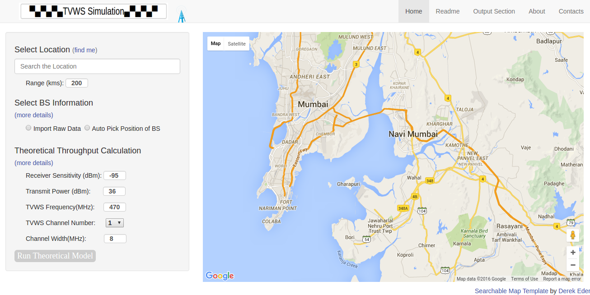

# Graphical-Tool-for-TVWS-Network-Deployments
###### This is a graphical tool for TVWS network deployment which can simulate large geographical region. The tool have integrated Google map on which user can choose the location of base station position. User have the freedom to select underlying MAC protocol and can compare their performance.

## Home Page of the Tool

## Features
- We have an auto pick option for BS position. Our tool can automatically pick the best position of BS and associated other information like population, throughput requirement for each user at each BS position etc. Currently the auto pick option is
available only for Thane district of Maharashtra. We have another options by which user can import their own BS position informations for simulation. 
- User can move the BS on Google map to chose their convenient position.
- We design the tool for both TDMA and CSMA MAC protocol. User have the option to configure different MAC protocol specific parameters.
- Our tool can automatically place intermediate node to create a single connected network by all BS together.
- Our tool can generate the details statistics of the whole configuration.
## To Setup:
